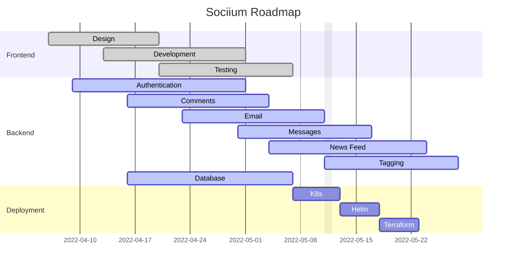

<center>

# Sociium


</br>

An open-source, self-hosted social network using distributed architecture and event-driven design.

</center>

## ⚡️ Quickstart

In order to get started with this project, you will typically want to start with a kubernetes cluster. There are a multitude of different ways to obtain a cluster, but I have written out a couple of terraform files that can quickly spin you up a cluster on either DigitalOcean or Google Cloud.

Signing up for a DO or GCP account is out of scope for this documentation, so if you don't know how to do that please follow your provider's documentation first and come back to this documentation once you've set that up. You can obtain a free copy of terraform [here](https://www.terraform.io/docs). Please remember to contribute to Open Source software like this when you can in order to promote your own happiness, success, and joy.

All deployment-related code can be found within the [IaC](/IAC) folder. The terraform modules, not surprisingly, are located inside of the [Terraform](IAC/terraform) folder. From here you can choose to cd into either th [digitalocean-cluster](/IAC/terraform/digitalocean-cluster/) folder or the [gcp-cluster](IAC/terraform/gcp-cluster/) depending on your provider. If you are using another provider you can find the documentation to create modules for that on the [Terraform Registry](https://registry.terraform.io/).

Once you have picked your provider, ultimate happiness is imminent. Let's begin by initializing terraform:

```bash
 terraform init
```

You will see terraform saving you time and headaches as you go through the process. This is generally a good thing.

Let's continue applying great vibes to our cluster:

```bash
terraform plan
```

Terraform will plan out the changes that will be made to your cluster. If terraform is unhappy with your changes, it will tell you what it thinks is wrong. Do not worry, it takes great care to not hurt your feelings. Google whatever problem it is telling you and then we can continue along the path to inner peace and joy.

If you are happy and ready for a successful life, you can apply the changes:

```bash
terraform apply
```

#### 🎉 Celebration break

You should now have a cluster up and running. If you are not, you can always go back and try again. We root for you and your general success. Please submit issues in times of sadness and frustration.

If, however, you are happy with the cluster, you can now begin a celebration of your success. Big steps have been taken, and there are more to come. Joy and dancing are recommended during this time.

## ⚙️ Installation

Once you've gotten the cluster up and running, you can begin installing the k8's manifests. This is done by running the following command, if success is your goal:

```bash
kubectl apply -f IAC/orchestration/kubernetes/[name_of_manifest]
```

For happiness, it is important to understand you must replace [name_of_manifest] with the name of the manifest you wish to apply.

If helm is your go-to, you can also use that with the templates in the [helm](IAC/orchestration/helm/). Helm is a package manager that can be used to suppliment your general happiness and joy during the k8's experience. I recommend achieving as much happiness as possible.

## 🎯 Features

- [x] Kubernetes Hosting, with distributed design and deployment
- [x] Helm Charts
- [x] IaC with Terraform
- [x] Social Media Platform
- [x] RTC chat with people on friends list using Socket.io
- [x] News Feed with ability to post, comment and like.
- [x] Authentication using oidc
- [x] User Profile with profile pic, bio, etc.
- [ ] AI for insta-banning woke political statements (can turn off, but for general happiness and joy keep on)
- [ ] Friends List
- [ ] group chats

## 📚️ Documentation

This ReadMe is a work in progress. I will be adding more features and documenting them as I go. Please check back for more - I know this is very incomplete and I take your happiness seriously, so please feel free to submit issues and suggestions.

## 📌 Roadmap

**Dates presented here are tentative and subject to change**



## 💎 Contributing

Want to contribute? What a chad move!

I'm always open to ideas and suggestions. If you find/have a suggestion, please submit an issue so we can track it properly and get to work on it.

If you'd like to contribute your suggested change please submit a pull request! This project follows the [Git Flow](https://datasift.github.io/gitflow/IntroducingGitFlow.html) branching model. Essentially, once you pull the code, create a branch for your change and commit it. Once that's done you ca submit a pull request to then be reviewed and merged later. This generally promotes greater happiness and joy for all collaborators.
